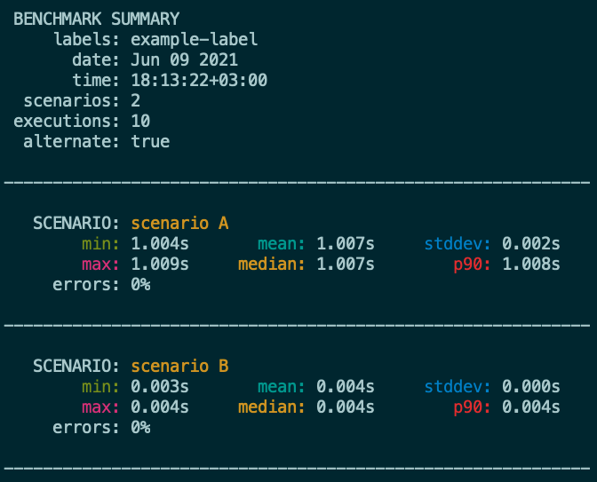

[](https://github.com/sha1n/benchy/actions/workflows/go.yml)

[](https://goreportcard.com/report/sha1n/benchy) 
[](https://coveralls.io/github/sha1n/benchy?branch=master)
[](https://github.com/sha1n/benchy/releases)
[](https://github.com/sha1n/benchy/actions/workflows/release-drafter.yml)
[](https://opensource.org/licenses/MIT)


# Benchy
`benchy` is a CLI benchmarking tool that allows you to easily compare performance metrics of different CLI commands. I developed this tool to benchmark and compare development tools and configurations on different environment setups and machine over time. It is designed to support complex scenarios that require high level of control and consistency.


- [Benchy](#benchy)
  - [Overview](#overview)
  - [Main Features](#main-features)
  - [Installation](#installation)
    - [Download A Pre-Built Release](#download-a-pre-built-release)
    - [Build From Sources](#build-from-sources)
  - [Usage](#usage)
  - [Configuration](#configuration)
  - [Report Formats](#report-formats)
    - [Text Example](#text-example)
    - [CSV Example](#csv-example)
    - [Markdown Example](#markdown-example)
    - [Raw CSV Example](#raw-csv-example)
  - [Output Control](#output-control)
  - [Alternatives](#alternatives)


## Overview
`benchy` is designed with focus on benchamrk environment control and flexibility in mind. It was originally built to:
- Benchamrk complex, relatively long running commands such as build and test commands used on software development environments.
- Benchmark the exact same set of command scenarios on different machines or environments in order to compare them later.
- Collect raw metrics and use external analysis toos to process them.

## Main Features
- Benchmark any number of commands
- Rerun the exact same benchmark again and again on diffeent machines or environments, accumulte results and compare them later
- Set the number of times every scenario is executed
- Choose between alternate executions and sequential execution of the same command
- Save results in `txt`, `csv`, `csv/raw`, `md` and `md/raw` formats
- Control your benchmark environment
  - Set your working directory per scenario and/or command 
  - Set optional custom environment variables per scenario
  - Set optional setup/teardown commands per scenario
  - Set optional before/after commands for each run

## Installation
### Download A Pre-Built Release
Download the appropriate binary and put it in your `PATH`.

```bash
# macOS Example (assuming that '$HOME/.local/bin' is in your PATH):
curl -sSL https://github.com/sha1n/benchy/releases/latest/download/benchy-darwin-amd64 -o "$HOME/.local/bin/benchy"

# once you have it, you can update using the update command
benchy update
```

### Build From Sources
```bash
# macOS Example (assuming that '$HOME/.local/bin' is in your PATH):
git clone git@github.com:sha1n/benchy.git
cd benchy
make 
cp ./bin/benchy-darwin-amd64 ~/.local/bin/benchy
```

## Usage
```bash
benchy --config test/data/spec_test_load.yaml

benchy --help   # for full options list
```

## Configuration
`benchy` reads benchmark specifications from a config file. The config file can be either in YAML or JSON format. `benchy` treats files with the `.json` extension as JSON, otherwise it assumes YAML. You may create a configuration file manually or use the `config` command to interactively generate your configuration.

More about configuration [here](configuration.md).


## Report Formats
There are three supported report formats, two of them support `raw` mode as follows. The formats are `txt`, `csv`, `csv/raw`, `md` and `md/raw`. `txt` is the default format and is primarily designed to be used in a terminal. `csv` is especially useful when you want to accumulate stats from multiple benchmarks in a standard convenient format. In which case you can combine the `csv` format with `-o` and possibly `--header=false` if you want to accumulate data from separate runs in one file. 
`csv/raw` is streaming raw trace events as CSV records and is useful if you want to load that data into a spreadsheet or other tools for further analysis.
`md` and `md/raw` and similar to `csv` and `csv/raw` respectively, but write in Markdown table format.

**Selecting Report Format:**
```bash
# The following command will generate a report in CSV format and save it into a file 
# named 'benchamrk-report.csv' in the current directory.
benchy --config benchmark-config.yml --format csv --out-file benchamrk-report.csv

# Here is an equivalent command that uses shorthand flag names.
benchy -c benchmark-config.yml -f csv -o benchamrk-report.csv
```

### Text Example


### CSV Example
```csv
Timestamp,Scenario,Labels,Min,Max,Mean,Median,Percentile 90,StdDev,Errors
2021-05-18T23:38:49+03:00,scenario A,example-label,1003508458.000,1009577781.000,1006281483.700,1006164208.500,1008256954.000,2122427.909,0
2021-05-18T23:38:49+03:00,scenario B,example-label,2953009.000,4218971.000,3818925.400,3854585.000,4048263.000,317884.931,0
```

### Markdown Example
```
|Timestamp|Scenario|Samples|Labels|Min|Max|Mean|Median|Percentile 90|StdDev|Errors|
|----|----|----|----|----|----|----|----|----|----|----|
|2021-05-21T16:21:13+03:00|scenario A|10|example-label|1.004s|1.010s|1.007s|1.008s|1.008s|0.002s|0%|
|2021-05-21T16:21:13+03:00|scenario B|10|example-label|0.001s|0.005s|0.004s|0.004s|0.004s|0.001s|0%|
```

### Raw CSV Example
```csv
Timestamp,Scenario,Labels,Duration,Error
2021-05-21T00:58:37+03:00,scenario A,example-label,1008861268,false
2021-05-21T00:58:37+03:00,scenario B,example-label,4021420,false
2021-05-21T00:58:38+03:00,scenario A,example-label,1006453206,false
2021-05-21T00:58:38+03:00,scenario B,example-label,3753389,false
2021-05-21T00:58:39+03:00,scenario A,example-label,1004680188,false
2021-05-21T00:58:39+03:00,scenario B,example-label,3780530,false
2021-05-21T00:58:40+03:00,scenario A,example-label,1005864471,false
2021-05-21T00:58:40+03:00,scenario B,example-label,3812982,false
2021-05-21T00:58:41+03:00,scenario A,example-label,1006431680,false
2021-05-21T00:58:41+03:00,scenario B,example-label,5208588,false
2021-05-21T00:58:42+03:00,scenario A,example-label,1005159913,false
2021-05-21T00:58:42+03:00,scenario B,example-label,3708653,false
2021-05-21T00:58:43+03:00,scenario A,example-label,1006895996,false
2021-05-21T00:58:43+03:00,scenario B,example-label,3261679,false
2021-05-21T00:58:44+03:00,scenario A,example-label,1008155810,false
2021-05-21T00:58:44+03:00,scenario B,example-label,3846961,false
2021-05-21T00:58:45+03:00,scenario A,example-label,1007275165,false
2021-05-21T00:58:45+03:00,scenario B,example-label,4039325,false
2021-05-21T00:58:46+03:00,scenario A,example-label,1003687652,false
2021-05-21T00:58:46+03:00,scenario B,example-label,3981022,false
```


## Output Control
By default `benchy` logs informative messages to standard err and report data to standard out (if no output file is specified). 
However, there are several ways you can control what is logged and in what level of details.

- `--pipe-stdout` and `--pipe-stderr` - pipe the standard out and err of executed benchmark commands respectively, to standard err.
- `--silent` or `-s` - sets the logging level to the lowest level possible, which includes only fatal errors. That is a softer version of `2>/dev/null` and should be preferred in general.
- `--debug` or `-d` - sets the logging level to the highest possible level, for troubleshooting.

## Alternatives
Before devloping `benchy` I looked into the following tools. Both target similar use-cases, but with different focus. If you need to quickly compare two commands, I would recommend looking into these.
- [hyperfine](https://github.com/sharkdp/hyperfine) 
- [bench](https://github.com/Gabriel439/bench) 
